# 实现页面内容 - Part 2

今天的课程我们继续来练习用 float 布局。我们会学到

1. Block Formatting Context 的用处
2. 用 border-box 简化 CSS 布局

这个课程里面的练习我们会给较少的提示。间距的微调和例行风格调整（比如去除 ul 的风格）请你自己记得去做！

# 实现 Education and Experience


这个布局的思路很简单：

1. 让图片浮动；
2. 图片和文字之间设定间隔。

用 float 实现左右布局是个很常见的设计模型。不过这里有个排版的坑要注意一下。

如果我们有个向左的浮动元素，在其右有住够的空间，那么接下来的内容会全部在飘动元素的右边。这是我们想要的的布局：

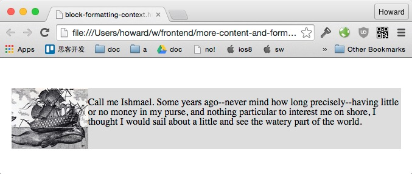

但如果内容超过了飘动元素的高度，这些内容就会包围住该飘动元素：

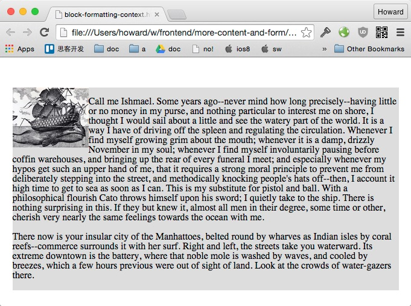

我们来看看怎么解决这个问题。

### CSS 设计模型 - float 布局避免内容包围飘动元素

[避免内容包围飘动元素 Demo](demo/block-formatting-context.html)

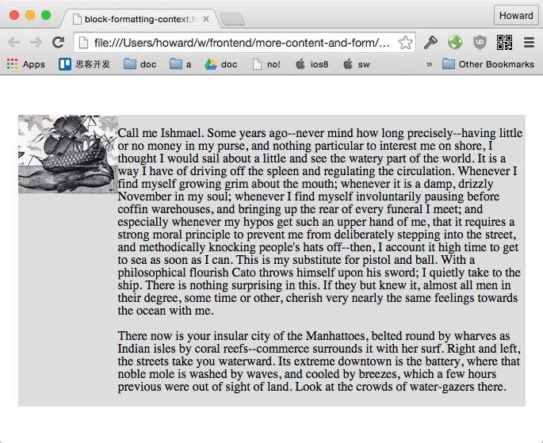

**HTML**:

```html
<div class="container">
  <!-- This image floats to the left -->
  

  <!-- The article should not wrap around the floated image -->
  <article class="content">
    <p>Call me Ishmael....</p>

    <p>There now is your insular city of the Manhattoes...</p>
  </article>

</div>
```

**CSS**:

```css
.float-left {
  float: left;
}

.content {
  overflow: hidden;
}
```

+ `float: left` 向左飘动的元素
+ `.content { overflow: hidden }` 避免这个容器里面的文字包围容器外面的浮动元素。

**实现原理**：

看到 `overflow: hidden` 你应该会想到我们之前用这个属性来让容器包围飘动元素。这个属性影响了容器计算高度的算法。

`overflow: hidden` 对容器还有一个重要的改变，那就是把该容器变成了一个新的 [block formatting context](http://www.w3.org/TR/CSS21/visuren.html#block-formatting) （简称 bfc）。如果一个容器有自己的 bfc，它就不会被外面的浮动元素覆盖。

我们再来看看之前的例子。 为了方便示范，我们把 `.content` 的颜色调为红色，浮动图片是半透明的。

如果 .content 没有自己的 bfc (`overflow: visible`), 效果是这样：

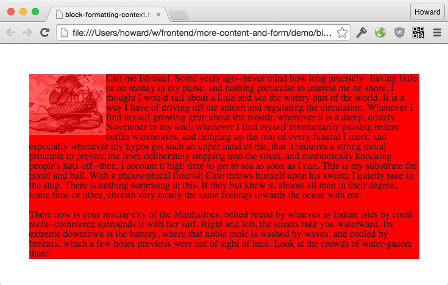

你可以看到 .content 的内容虽然会避开浮动图片，但这个容器本身是被覆盖的。

如果 .content 有自己的 bfc，效果是这样：

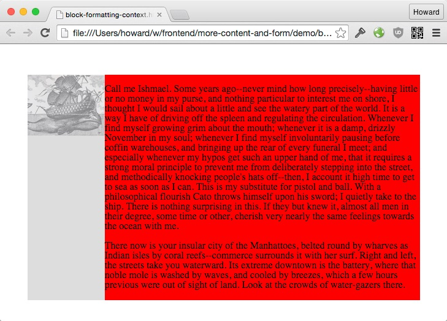

容器为了不被飘动图片覆盖，宽度缩小了。

关于 bfc 的衍生阅读：

1. [CSS 101: Block Formatting Contexts](http://yuiblog.com/blog/2010/05/19/css-101-block-formatting-contexts/)
2. [How does the CSS Block Formatting Context work?](http://stackoverflow.com/a/6199172)


### 练习 - Education and Experience

+ 设定图片的宽度为 180px
+ 用 float 布局
+ 为文字内容加上一个包围容器，创建新的 bfc

在 HTML 里面去加上更多的文字内容，确认这些文字不会围绕飘动元素。

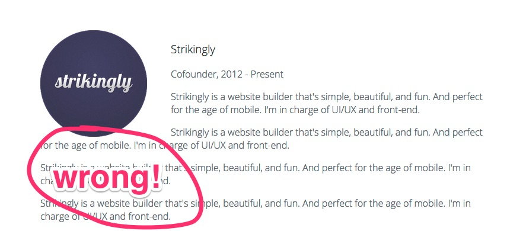

你的成果：

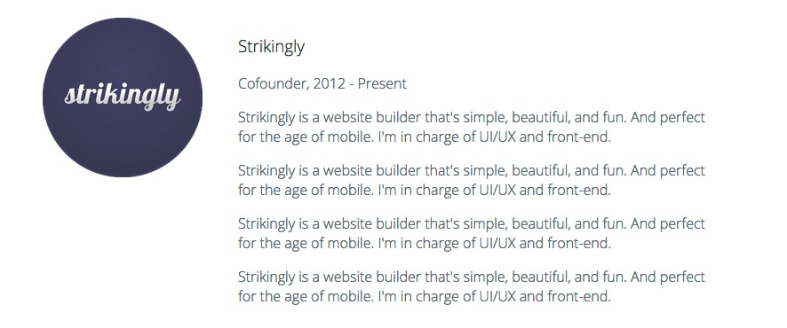

# 实现 Photos


传统的盒子模型对 CSS 布局相当不利。在默认的情况下一个盒子的最终尺寸是：

+ width & height
+ 加上 padding
+ 加上 border

这有什么问题呢？举个简单的例子，我想用四个元素充满他们的父容器, 都是 25% 宽：

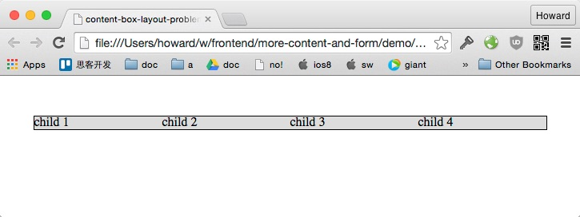

加上 border (或者 padding) 这个布局就跪了：

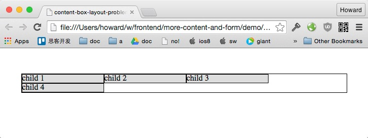

这是因为 content-box 在 25% 的宽度之上加上了 1px 像素的边际，导致容器的宽度不够容纳 `child 4`, 所以它就断行了。

### CSS 设计模型 - 全局使用 border-box 简化布局

对布局来说 content-box 只有弊没有利。`border-box` 的特性是 padding 和 border 算在你指定的宽度里面，所以宽度你说多少就是多少。下面这张图对比两个宽度同样是 '200px' 的盒子：

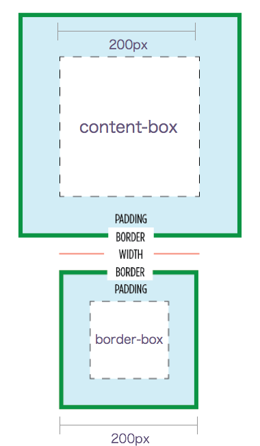

用上了 border-box，之前 25% 宽加上 border 的例子就能正确排版了。

[全局使用 border-box 的盒子模型 Demo](demo/border-box-layout.html)

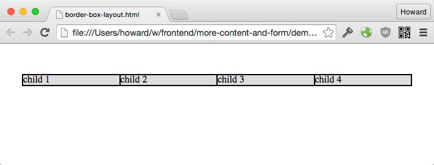

**CSS**:

```css
html {
  box-sizing: border-box;
}

*, *:before, *:after {
  box-sizing: inherit;
}
```

**实现原理**:

[Can I Use - box-sizing](http://caniuse.com/#search=box-sizing)

+ `box-sizing: border-box` 设定 html 为 border-box
+ `box-sizing: inherit` 其他元素基础父元素的 box-sizing 属性

这样的结果是所有元素都通过继承获得 border-box 的属性。全选也可以达到一样的目的：

```css
* {
  box-sizing: border-box;
}
```

但这种做法有个缺陷：页面如果有某些组件需要切换回 content-box 的话是很麻烦的。你得这么写：

```css
.use-content-box * {
  box-sizing: content-box;
}
```

这种选择器对效率有较大的影响。相比之下，通过继承来切换 box-sizing 更简易：

```css
.use-content-box {
  box-sizing: content-box;
}
```

.use-content-box 所有子元素都会通过继承获得 content-box 的属性。

### 练习 - 实现 Photos

+ 用 border-box
+ 图片之间的间距用 `padding: 10px`
+ img 宽度设定为 100% (即其父容器的宽度)

成果：


